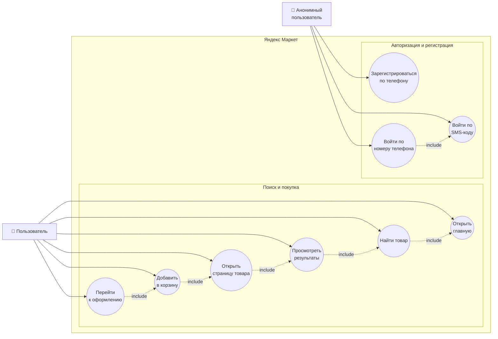
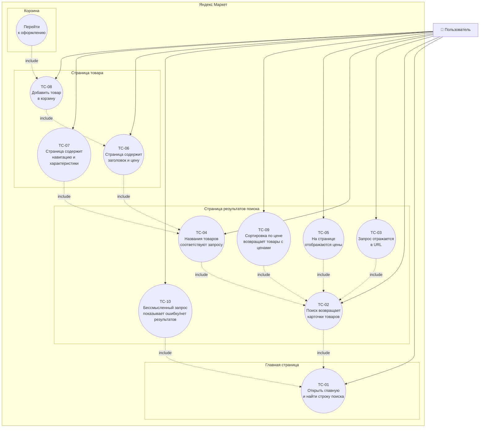
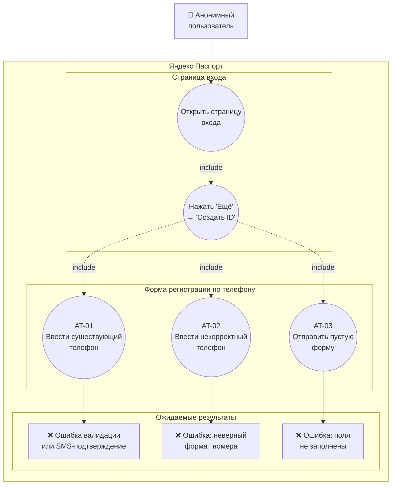
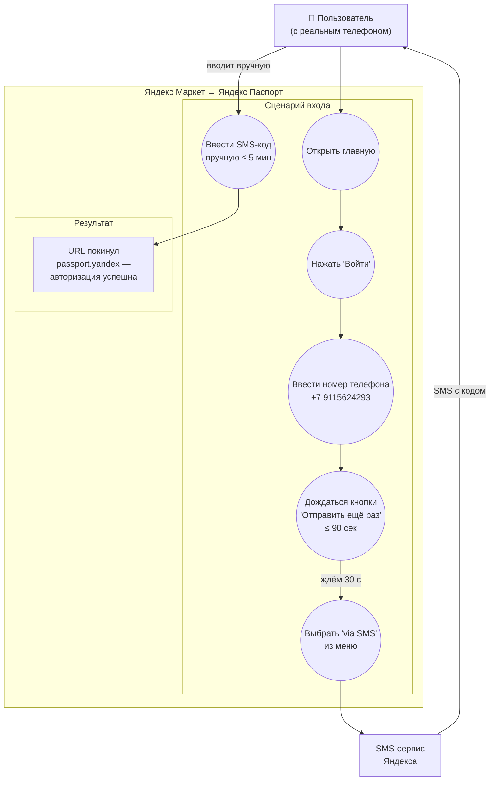
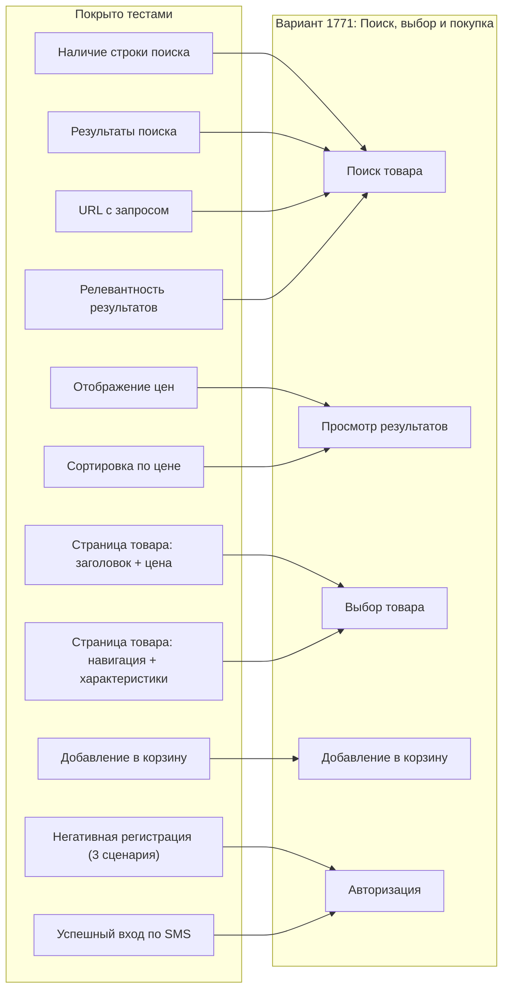

# Use Case Диаграммы — TPO Lab 3: Яндекс Маркет

## Общий обзор

---

## SearchTest — Поиск, выбор и покупка товаров

### Детали тест-кейсов SearchTest

| ID | Название | Браузеры | Профиль |
|----|----------|----------|---------|
| TC-01 | Главная страница содержит поиск | Chrome + Firefox | нет |
| TC-02 | Поиск возвращает товары ("ноутбук") | Chrome + Firefox | нет |
| TC-03 | Запрос отражается в URL ("смартфон") | Chrome + Firefox | нет |
| TC-04 | Названия товаров соответствуют запросу ("телевизор") | Chrome + Firefox | нет |
| TC-05 | На странице результатов доступны цены ("наушники") | Chrome + Firefox | нет |
| TC-06 | Страница товара содержит заголовок и цену ("телевизор") | Chrome + Firefox | нет |
| TC-07 | Страница товара содержит навигацию и характеристики ("холодильник") | Chrome + Firefox | нет |
| TC-08 | Можно добавить товар в корзину и перейти к оформлению ("мышь") | Firefox | да |
| TC-09 | Сортировка по цене доступна и возвращает цены ("пылесос") | Chrome + Firefox | нет |
| TC-10 | Бессмысленный запрос (".....")  показывает отсутствие результатов или ошибку | Chrome + Firefox | нет |
| TC-11 | Фильтр по цене 20000–50000 ₽ — все цены первой страницы (~12 карточек) в диапазоне | Chrome + Firefox | нет |

---

## AuthTest — Негативные сценарии регистрации

### Детали тест-кейсов AuthTest

| ID | Название | Браузеры | Ожидаемый результат |
|----|----------|----------|---------------------|
| AT-01 | Регистрация с существующим номером | Chrome + Firefox | Ошибка валидации или SMS-подтверждение |
| AT-02 | Регистрация с некорректным номером ("123") | Chrome + Firefox | Ошибка валидации |
| AT-03 | Регистрация с пустыми полями | Chrome + Firefox | Ошибка валидации |

---

## LoginTest — Успешная авторизация по SMS

> **Запуск:** `mvn test -Dtest=LoginTest`  
> Во время теста необходимо вручную ввести SMS-код в открывшемся браузере.

---

## Матрица покрытия

